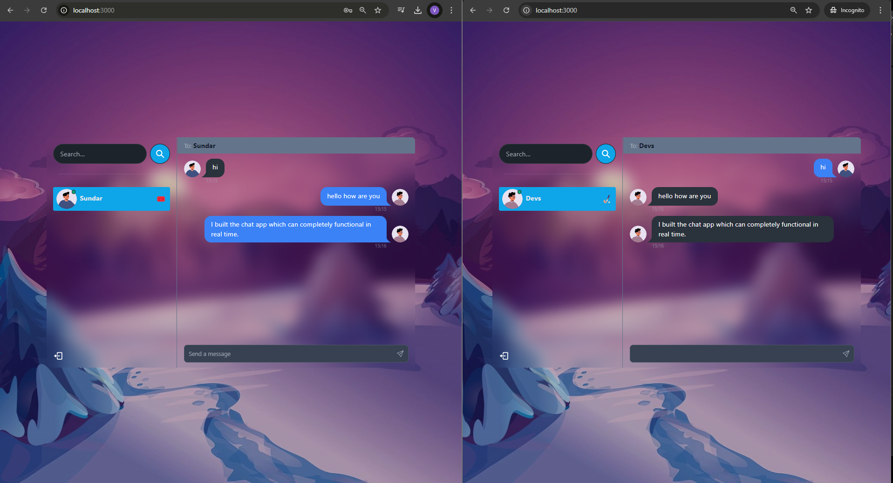

# 📲 MERN Stack Project: Real-Time Chat App with JWT, Socket.io, and Tailwind CSS



Welcome to the **Real-Time Chat App**, a modern, full-stack chat application featuring the MERN stack, real-time communication, and a clean, responsive UI built with Tailwind CSS. This project demonstrates key aspects of real-time messaging, authentication, and user [experience optimization](http://-live-chat-link.com)

## ✨ Key Features

- **🌐 Tech Stack:** Built using MongoDB, Express, React, Node.js, Socket.io, Tailwind CSS, and Daisy UI.
- **🔐 Secure Authentication:** JWT-based authentication for user login and session handling.
- **💬 Real-Time Messaging:** Powered by Socket.io for instant message delivery and notifications.
- **🟢 Online Status Tracking:** Real-time online/offline status updates with Socket.io and React Context API.
- **📡 State Management:** Managed using Zustand for efficient global state management.
- **🐛 Robust Error Handling:** Comprehensive error handling on both server and client sides.
- **🚀 Easy Deployment:** Tips and tricks for deploying your app for **FREE** on platforms like Heroku and Vercel.
- **⏳ Additional Features:** User-friendly UI, typing indicators, read receipts, and more.

---

## 🛠️ Project Setup

### Prerequisites

- Node.js and npm installed
- MongoDB database set up (local or cloud-based like MongoDB Atlas)

### Installation

1. **Clone the Repository:**

   ```bash
   git clone https://github.com/CodeBoyD7/chat-app.git

    cd chat-app

    npm run build

    npm start

   ```
